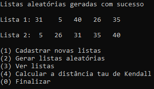
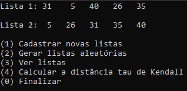
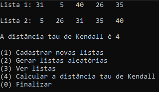

# Distância tau de Kendall

**Número da Lista**: 4<br>
**Conteúdo da Disciplina**: Dividir e Conquistar<br>

## Alunos
| Matrícula | Aluno |
| -- | -- |
| 18/0114077 | Lucas Rodrigues Fonseca |
| 18/0113861 | Kleidson Alves Corrêa |

## Sobre 
**O programa consiste basicamente em contar a quantidade de inversões que existem entre duas listas, conforme a seguinte questão:**<br>
Suponha dadas duas permutações, digamos A[1 .. n] e B[1 .. n], de um mesmo conjunto de números. A distância τ de Kendall entre A e B é o número de pares de elementos do conjunto que estão em ordem diferente em A e B, ou seja, o número │X − Y│ onde X é o conjunto de todos os pares (A[i], A[j]) tais que i < j e Y é o conjunto de todos os pares (B[i], B[j]) tais que i < j. (A definição não é assimétrica pois │X − Y│ = │Y − X│.) Escreva uma função eficiente que calcule a distância τ de Kendall entre A e B.
<br><br>
**Essa questão pode ser encontrada [nesse link](https://www.ime.usp.br/~pf/analise_de_algoritmos/aulas/divide-and-conquer.html).**
- Utilizando como exemplo as listas [1, 3, 2] e [3, 2, 1], podem ser identificadas 2 inversões, os pares (1, 3) e (1, 2).
- Utilizando como exemplo as listas [4, 2, 1, 0] e [1, 2, 0, 4], podem ser identificadas 4 inversões, os pares (4, 1), (4, 2), (4, 0) e (1, 2).


## Screenshots
| Listas aleatórias | Visualização das listas | Cálculo da distância |
| :-: | :-: | :-: |
|  |  |  |

## Instalação 
**Linguagem**: C++<br>

### Como instalar as dependências
```
sudo apt install git
sudo apt install make
sudo apt install g++
```

### Como executar
```
git clone https://github.com/projeto-de-algoritmos/D-C_KendallTau
cd D-C_KendallTau
make
make run
```

## Uso 
**Para navegar no menu basta entrar com o número associado à opção desejada.**
- **Cadastrar novas listas:** Primeiro deve ser inserida a quantidade de elementos que fazem parte do conjunto de números que serão utilizados. Em seguida devem ser informados esses números na ordem desejada para a lista 1 e em seguida para a lista 2.
- **Gerar listas aleatórias:** Deve ser informada a quantidade de elementos que devem ser gerados para o conjunto para que as listas sejam geradas de forma aleatória.
- **Ver listas**: Permite a visualização das listas que estão atualmente sendo utilizadas.
- **Calcular a distância tau de Kendall:** Imprime as listas e a distância tau de Kendall entre elas.

## Outros 
- Para a contagem de inversões foi utilizado o mergesort
- O vídeo explicativo está na pasta raíz do projeto
